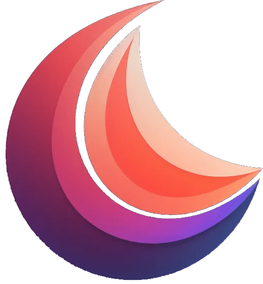

<h1 align="center"> RestClient and GraphQL final Task</h1>

<h2 align="center"> RS School React 2024 Q3</h2>

<p align="center">
  
</p>

Our app is a light-weight versions of Postman and GraphQL combined in one app (Postman is a rich platform for using (and building) APIs. GraphQL is a playground/IDE for graphQL requests).

<div align="center" style="display: flex; justify-content: center; padding: 5px; flex-wrap: wrap;">
  
  
  
</div>

## Team project by [Nadia](https://github.com/nadyavalin), [Kate](https://github.com/ifbfirst), and [Eugene](https://github.com/LarryDavidd)

[The Rolling Scopes School React Course](https://rs.school/react/) | [Link to the task](https://github.com/rolling-scopes-school/tasks/blob/master/react/modules/tasks/final.md)

### Completed: September 2024

## Technology stack


<!-- TABLE OF CONTENTS -->

## Table of Contents

- [Project description](#rs-school-react-2023-q4)
- [Technology stack](#technology-stack)
- [Getting Started](#getting-started)
- [Installation](#installation)
- [Scripts](#provided-scripts)

<!-- GETTING STARTED -->

## Getting Started

To get a local copy - follow these simple steps.

### Installation

1. Clone the repo

```sh
  git clone https://github.com/gentoosiast/graphiql-app
```

2. Install NPM packages

```sh
  npm install
```

3. Ask team to produce the .env.local file with settings and place it in the project root.

4. Start project

```sh
  npm run dev
```

<!-- SCRIPTS -->

## Provided scripts

```sh
npm run dev
```

Start local development server

```sh
npm run build
```

Build project in production mode for further deployment

```sh
npm run format:fix
```

Reformat source code & configs to match `Prettier` settings

```sh
npm run lint
```

Check source code with `ESLint`. Exit with non-zero return code after the first found warning (useful for CI/CD)

```sh
npm run lint:fix
```

Automatically fix all auto-fixable errors & warnings with `ESLint`

```sh
npm run typecheck
```

Perform TypeScript typechecking of source code with `tsc` (TypeScript Compiler)

```sh
npm run preview
```

Locally preview the production build

```sh
npm run prepare
```

Runs automatically after package installation to install Husky hooks

```sh
npm run test
```

Runs tests with Vitest and displays coverage of implemented tests
